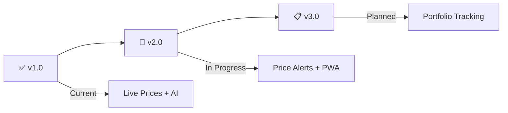

<div align="center">

# 💰 GoldFlow

### _Track Precious Metals. Make Smarter Investments._

**Real-time Gold & Silver prices powered by AI market analysis**

[](https://your-site.netlify.app)
[](https://github.com/RACHIT-KUSHWAHA/GoldFlow)
[](LICENSE)


---

</div>

## ✨ Features at a Glance

<table>
<tr>
<td width="50%">

### 💹 Real-Time Tracking
- 🔴 **Live Gold & Silver Prices**
- 🌍 **10 Global Currencies**
- ⚖️ **5 Unit Conversions**
- 📊 **24h High/Low Tracking**
- 🎯 **Price Change Indicators**

### 🌍 Global Markets
- 💎 **International Spot Prices**
- 🇮🇳 **India** (13% markup)
- 🇺🇸 **USA** (8% markup)
- 🇬🇧 **UK** (20% VAT)
- 🇦🇪 **UAE** • 🇸🇬 **Singapore** • 🇨🇳 **China**
- 🇸🇦 **Saudi Arabia** • 🇹🇷 **Turkey**

</td>
<td width="50%">

### 🤖 AI-Powered Analysis
- 🧠 **Groq AI** (LLaMA 3.3 70B)
- 📈 **Market Trend Analysis**
- 💡 **Buy/Sell/Hold Signals**
- 🎯 **Technical Indicators**
- ⏰ **Hourly Updates**

### 📊 Advanced Tools
- 📉 **Interactive Charts** (Chart.js)
- 🕐 **Multiple Timeframes**
- 💾 **30-Day History**
- � **CSV Export**
- ⚡ **Smart Caching**

</td>
</tr>
</table>

## 🛠️ Tech Stack

```text
Frontend    →  HTML5 • CSS3 • Vanilla JavaScript (ES6+)
Charts      →  Chart.js v4.4.0
APIs        →  gold-api.com • Groq AI (LLaMA 3.3 70B)
Deployment  →  Netlify (Serverless Functions)
Storage     →  localStorage (Client-side caching)
```

## 🚀 Quick Start

### For Users
```bash
# 1. Clone the repository
git clone https://github.com/RACHIT-KUSHWAHA/GoldFlow.git

# 2. Open in browser
open index.html

# Or use a local server
python -m http.server 8000
```

### For Developers (with AI Features)

**Setup Groq API:**
1. Get free API key → [console.groq.com](https://console.groq.com)
2. Add to `script.js`:
   ```javascript
   const GROQ_API_KEY = 'your_key_here';
   ```

**Deploy on Netlify:**
1. Connect your GitHub repo
2. Add environment variable: `GROQ_API_KEY`
3. Deploy! (Functions handle API keys securely)

## 🎯 Roadmap



- [ ] 🔔 Price alert notifications
- [ ] 📱 PWA support for offline access
- [ ] 💎 Platinum & Palladium tracking
- [ ] 📊 Advanced technical indicators (SMA, RSI, Bollinger Bands)
- [ ] 🌐 Multi-language support

---

## 🤝 Contributing

Love GoldFlow? **Star ⭐** this repo and contribute!

```bash
# Fork → Clone → Create Branch → Commit → Pull Request
git checkout -b feature/YourFeature
git commit -m "Add YourFeature"
git push origin feature/YourFeature
```

---

## � Performance

| Metric | Value |
|--------|-------|
| Load Time | < 2s |
| API Calls | 7/hour |
| Cache Hit Rate | ~85% |
| Mobile Score | 95/100 |

---

<div align="center">

## 📄 License

MIT © 2025 [RACHIT-KUSHWAHA](https://github.com/RACHIT-KUSHWAHA)

---

### � Support This Project

If GoldFlow helped you track precious metals better, consider:

⭐ **Star this repo**  •  🐛 **Report bugs**  •  💡 **Suggest features**

---

**Built with ❤️ for precious metals enthusiasts worldwide**

[](https://developer.mozilla.org/en-US/docs/Web/JavaScript)
[](https://groq.com)
[](https://netlify.com)

[Report Bug](https://github.com/RACHIT-KUSHWAHA/GoldFlow/issues) • [Request Feature](https://github.com/RACHIT-KUSHWAHA/GoldFlow/issues) • [View Demo](https://your-site.netlify.app)

</div>
